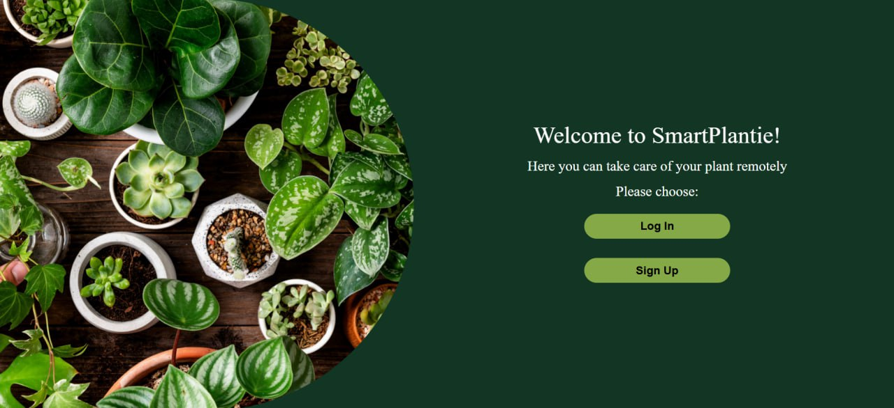
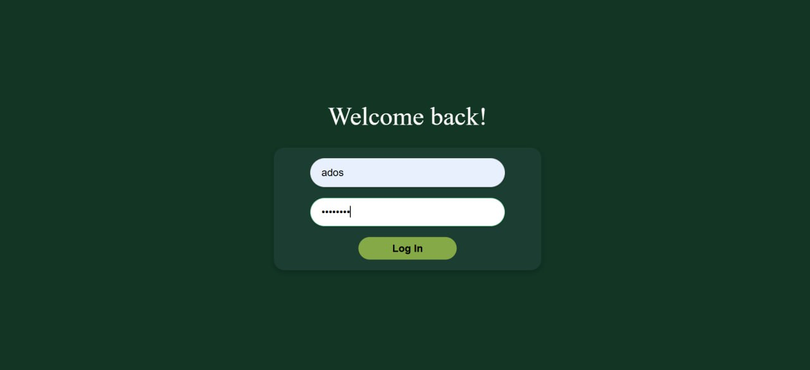
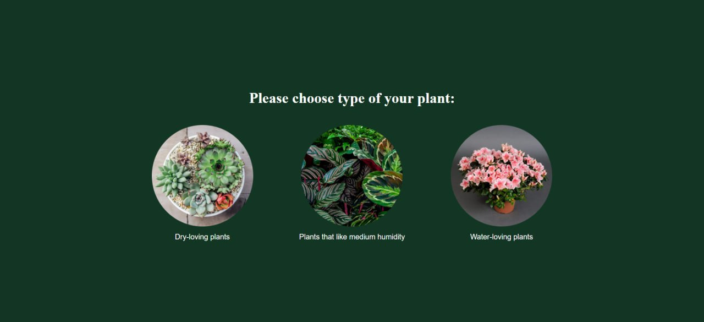
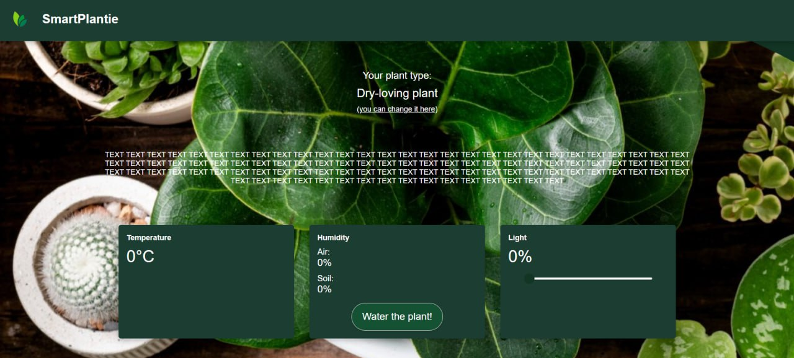

# IoT Plant Monitoring System

<div align="center">
  
</div>

## Overview

**IoT Plant Monitoring System** is a Spring Boot web application that enables users to monitor and manage their plants using IoT sensors. The application collects real-time data about plant conditions including temperature, humidity (air and soil), and light levels, allowing users to ensure their plants receive optimal care.

## Features

✅ **User Management**
- User registration and authentication
- Secure login system with Spring Security
- User profile management

✅ **Plant Monitoring**
- Track multiple plants with different types (Azalia, Calathea, Succulent, etc.)
- Real-time sensor data collection (temperature, humidity, light)
- Plant statistics and health monitoring
- IoT sensor integration via MQTT protocol

✅ **Web Interface**
- Responsive web UI built with Thymeleaf and Bootstrap
- Plant type selection and classification
- Statistical dashboard for plant data
- Welcome page and user-friendly design

✅ **Data Persistence**
- MySQL database for reliable data storage
- JPA/Hibernate ORM for database operations
- Automatic schema updates

✅ **REST API**
- RESTful endpoints for plant and user management
- JSON data exchange with GSON serialization

## Technology Stack

| Technology | Version | Purpose |
|-----------|---------|---------|
| Java | 17 | Programming language |
| Spring Boot | 3.4.1 | Framework |
| Spring Data JPA | - | Database ORM |
| Spring Security | - | Authentication & Authorization |
| Spring Web | - | REST API & Web MVC |
| Thymeleaf | - | Template engine |
| MySQL | 8+ | Database |
| Eclipse Paho MQTT | 1.2.5 | IoT communication |
| Lombok | - | Code generation |
| ModelMapper | 3.1.0 | DTO mapping |
| Maven | - | Build tool |
| Docker | - | Containerization |

## Project Structure

```
iot/
├── src/main/java/com/iot/
│   ├── Main.java                           # Application entry point
│   ├── config/                             # Configuration classes
│   │   ├── AppConfig.java
│   │   ├── PasswordConfig.java
│   │   └── SecurityConfig.java
│   ├── controllers/                        # REST & Web controllers
│   │   ├── PlantRestController.java
│   │   └── UserController.java
│   ├── domain/
│   │   ├── entity/                         # JPA entities
│   │   │   ├── Plant.java
│   │   │   └── User.java
│   │   ├── enums/                          # Enumerations
│   │   │   └── PlantType.java
│   │   └── exceptions/                     # Custom exceptions
│   │       ├── InvalidUserException.java
│   │       ├── PlantNotFound.java
│   │       └── PlantsException.java
│   ├── dto/                                # Data Transfer Objects
│   │   ├── PlantFullInfoDto.java
│   │   ├── PlantInfoDto.java
│   │   └── PlantStatsDto.java
│   ├── repository/                         # Data access layer
│   │   ├── PlantRepository.java
│   │   └── UserRepository.java
│   ├── services/                           # Business logic
│   │   ├── CustomUserDetailsService.java
│   │   ├── PlantService.java
│   │   └── UserService.java
│   └── utils/                              # Utility classes
│       ├── CustomAuthenticationSuccessHandler.java
│       └── CustomUserDetails.java
├── src/main/resources/
│   ├── application.properties               # Application configuration
│   ├── static/
│   │   ├── css/                            # Stylesheets
│   │   ├── js/                             # JavaScript files
│   │   └── images/                         # UI images
│   └── templates/                          # Thymeleaf templates
├── pom.xml                                 # Maven configuration
├── Dockerfile                              # Docker configuration
└── README.md                               # This file
```

## Installation

### Prerequisites

- Java 17 or higher
- Maven 3.6+
- MySQL 8.0+
- Docker (optional)

### Setup Instructions

1. **Clone the repository**
   ```bash
   git clone <repository-url>
   cd iot
   ```

2. **Configure MySQL Database**
   
   Update `src/main/resources/application.properties`:
   ```properties
   spring.datasource.url=jdbc:mysql://localhost:3306/iot
   spring.datasource.username=root
   spring.datasource.password=root
   ```
   
   Create the database:
   ```sql
   CREATE DATABASE iot;
   ```

3. **Build the project**
   ```bash
   mvn clean install
   ```

4. **Run the application**
   ```bash
   mvn spring-boot:run
   ```

   The application will be available at `http://localhost:8080`

### Docker Setup (Optional)

1. **Build Docker image**
   ```bash
   docker build -t iot-plant-monitor .
   ```

2. **Run Docker container**
   ```bash
   docker run -p 8080:8080 --name iot-plant iot-plant-monitor
   ```

## Usage

### User Registration & Login

<div align="center">
  
</div>

1. Navigate to the application homepage
2. Register a new account with your credentials
3. Log in with your username and password
4. Access the plant monitoring dashboard

### Adding Plants

<div align="center">
  
</div>

1. Click "Add Plant" on the dashboard
2. Select a plant type (Azalia, Calathea, Succulent, etc.)
3. Set up your IoT sensors (temperature, humidity, light)
4. Monitor real-time sensor data

### Monitoring & Statistics

<div align="center">
  
</div>

- View real-time sensor readings for each plant
- Check plant statistics and historical data
- Receive alerts when conditions are suboptimal
- Track plant health over time

## API Endpoints

### User Endpoints
- `POST /api/users/register` - Register a new user
- `POST /api/users/login` - User login
- `GET /api/users/{id}` - Get user details

### Plant Endpoints
- `GET /api/plants` - Get all plants for user
- `GET /api/plants/{id}` - Get plant details
- `POST /api/plants` - Create new plant
- `PUT /api/plants/{id}` - Update plant
- `DELETE /api/plants/{id}` - Delete plant
- `GET /api/plants/{id}/stats` - Get plant statistics

## Configuration

### MQTT Configuration

Configure MQTT broker connection in your application properties:
```properties
mqtt.broker=tcp://localhost:1883
mqtt.client-id=iot-plant-monitor
mqtt.username=username
mqtt.password=password
```

### Database Configuration

Adjust Hibernate settings in `application.properties`:
```properties
spring.jpa.hibernate.ddl-auto=update
spring.jpa.show-sql=true
spring.jpa.properties.hibernate.format_sql=true
```

## Security

- Passwords are encrypted using Spring Security's BCrypt encoder
- Custom authentication success handler for secure redirects
- CSRF protection enabled
- Input validation on all endpoints
